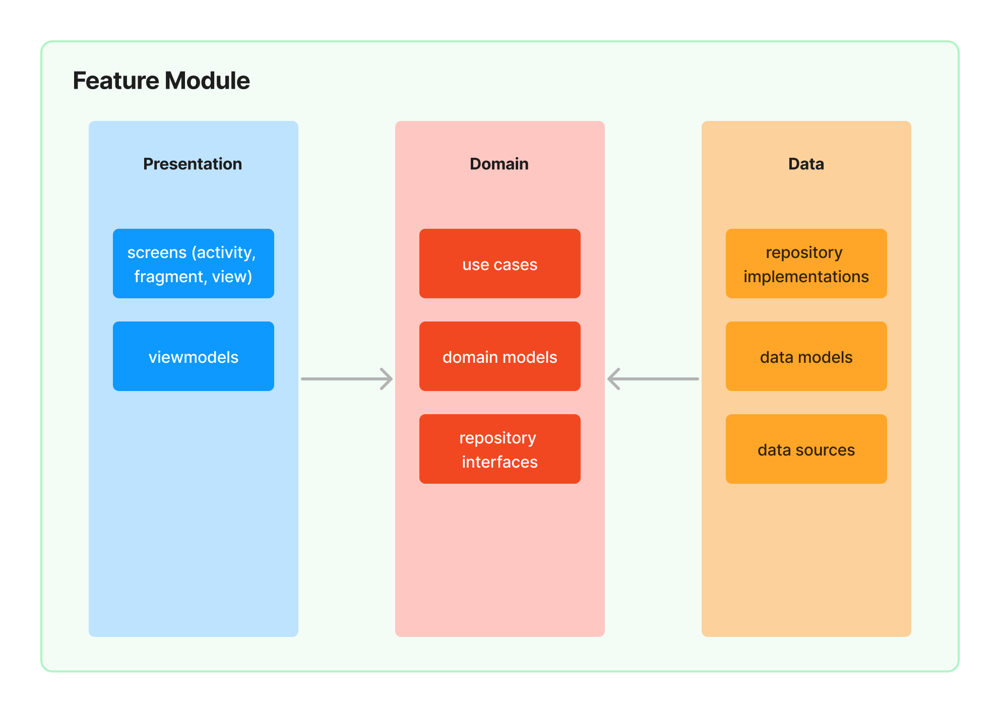

# Usercentrics App Challenge

[](https://kotlinlang.org)
[](https://developer.android.com/studio/releases/gradle-plugin)
[](https://gradle.org)

[](https://codebeat.co/projects/github-com-ratsilva-usercentrics-app-challenge-main)
[](https://www.codefactor.io/repository/github/ratsilva/usercentrics-app-challenge)

Usercentrics App Challenge is an android project built
with [Jetpack Compose](https://developer.android.com/jetpack/compose) and modern Android
methodologies and architecture.

The primary focus of this project is be a showcase of my skills as part os Usercentrics's
application process for the Apps Team. You can read the full
documentation [here](https://github.com/ratsilva/usercentrics-app-challenge/blob/main/misc/doc/documentation.pdf)

## Application Scope

The Usercentrics App Challenge is a simple application that presents a virtual cost of consented
data via Usercentrics UI framework.

The app has only one main screen located in **feature_virtual_cost** package:

<p>
    
    
    
    
</p>

## Tech-Stack

This project takes advantage of best practices and many popular libraries and tools in the Android
ecosystem. Most of
the libraries are in the stable version unless there is a good reason to use non-stable dependency.

* Tech-stack
    * [100% Kotlin](https://kotlinlang.org/)
        + [Coroutines](https://kotlinlang.org/docs/reference/coroutines-overview.html) - perform
          background operations
        + [Kotlin Flow](https://kotlinlang.org/docs/flow.html) - data flow across all app layers,
          including views
        + [Kotlin Symbol Processing](https://kotlinlang.org/docs/ksp-overview.html) - enable
          compiler plugins
        + [Kotlin Serialization](https://kotlinlang.org/docs/serialization.html) -
          parse [JSON](https://www.json.org/json-en.html)
    * [Retrofit](https://square.github.io/retrofit/) - networking
    * [Jetpack](https://developer.android.com/jetpack)
        * [Compose](https://developer.android.com/jetpack/compose) - modern, native UI kit
        * [Navigation](https://developer.android.com/topic/libraries/architecture/navigation/) -
          in-app navigation
        * [Lifecycle](https://developer.android.com/topic/libraries/architecture/lifecycle) -
          perform an action when lifecycle state changes
        * [ViewModel](https://developer.android.com/topic/libraries/architecture/viewmodel) - store
          and manage UI-related data in a lifecycle-aware way
        * [Room](https://developer.android.com/jetpack/androidx/releases/room) - store offline cache
    * [Koin](https://insert-koin.io/) - dependency injection (dependency retrieval)
    * [Lottie](http://airbnb.io/lottie) - animation library
* Modern Architecture
    * [Clean Architecture](https://blog.cleancoder.com/uncle-bob/2012/08/13/the-clean-architecture.html)
    * Single activity architecture
      using [Navigation component](https://developer.android.com/guide/navigation/navigation-getting-started)
    * MVVM + MVI (presentation layer)
    * [Android Architecture components](https://developer.android.com/topic/libraries/architecture)
      ([ViewModel](https://developer.android.com/topic/libraries/architecture/viewmodel), [Kotlin Flow](https://kotlinlang.org/docs/flow.html), [Navigation](https://developer.android.com/jetpack/androidx/releases/navigation))
    * [Android KTX](https://developer.android.com/kotlin/ktx) - Jetpack Kotlin extensions
* UI
    * Reactive UI
    * [Jetpack Compose](https://developer.android.com/jetpack/compose) - modern, native UI kit
    * [Material Design 3](https://m3.material.io/) - application design system providing UI
      components
* Testing
    * [Mockk](https://mockk.io/) - mocking framework
    * [Turbine](https://github.com/cashapp/turbine) - flow testing library
    * [Paparazzi](https://github.com/cashapp/paparazzi) - screenshot testing
* Gradle
    * [Gradle Kotlin DSL](https://docs.gradle.org/current/userguide/kotlin_dsl.html) - define build
      scripts
    * [Versions catalog](https://docs.gradle.org/current/userguide/platforms.html#sub:version-catalog) -
      define dependencies

## Architecture

By dividing a problem into smaller and easier-to-solve sub-problems, we can reduce the complexity of
designing and
maintaining a large system. Each module is an independent build block serving a clear purpose. We
can think about each
feature as a reusable component, the equivalent
of [microservice](https://en.wikipedia.org/wiki/Microservices) or private
library.

The modularized code-base approach provides a few benefits:

- reusability - enable code sharing and building multiple apps from the same foundation. Apps should
  be a sum of their features where the features are organized as separate modules.
- [separation of concerns](https://en.wikipedia.org/wiki/Separation_of_concerns) - each module has a
  clear API.
  Feature-related classes live in different modules and can't be referenced without explicit module
  dependency. We
  strictly control what is exposed to other parts of your codebase.
- features can be developed in parallel eg. by different teams
- each feature can be developed in isolation, independently from other features
- faster build time

### Module Types And Module Dependencies


We have four kinds of modules in the application:

- `app` module - this is the main module. It contains code that wires multiple modules together (
  class, dependency
  injection setup, `NavHostActivity`, etc.) and fundamental application configuration (retrofit
  configuration, required
  permissions setup, custom `Application` class, etc.).
- `feature_x` modules - the most common type of module containing all code related to a given
  feature.
- `core_x` modules that feature modules depend on to share a common code.
- `plugin_x` modules that wraps external libraries.

### Feature Module Structure

`Clean Architecture` is implemented at the module level - each module contains its own set of Clean
Architecture layers:


> Notice that the `app` module, `core_x` modules and `plugin_x` modules structure differs a bit from
> the feature
> module structure.

Each feature module contains non-layer components and 3 layers with a distinct set of
responsibilities.



#### Presentation Layer

This layer is closest to what the user sees on the screen.

The `presentation` layer mixes `MVVM` and `MVI` patterns:

- `MVVM` - Jetpack `ViewModel` is used to encapsulate a `UI state`. It exposes the `state` via
  observable state holder (`Kotlin Flow`)
- `MVI` - `action` modifies the `UI state` and emits a new state to a view via `Kotlin Flow`

> The `UI state` is a single source of truth for each view. This solution derives
>
from [Unidirectional Data Flow](https://en.wikipedia.org/wiki/Unidirectional_Data_Flow_(computer_science))
> and [Redux principles](https://redux.js.org/introduction/three-principles).

This approach facilitates the creation of consistent states. The state is collected
via `collectAsUiStateWithLifecycle` method. Flows collection happens in a lifecycle-aware manner, so
[no resources are wasted](https://medium.com/androiddevelopers/consuming-flows-safely-in-jetpack-compose-cde014d0d5a3).

Stated is annotated
with [Immutable](https://developer.android.com/reference/kotlin/androidx/compose/runtime/Immutable)
annotation that is used by Jetpack compose to enable composition optimizations.

#### Domain Layer

This is the core layer of the module. Notice that the `domain` layer is independent of any
other layers. This allows making domain models and business logic independent from other layers. In
other words,
changes in other layers will not affect the `domain` layer eg. changing the database (`data` layer)
or screen UI (`presentation` layer) ideally will not result in any code change within the `domain`
layer.

#### Data Layer

Encapsulates application data. Provides the data to the `domain` layer eg. retrieves data from
datasource (internet or local cache).

## Dependency Management


Gradle [versions catalog](https://docs.gradle.org/current/userguide/platforms.html#sub:version-catalog)
is used as a centralized dependency management third-party dependency coordinates (group, artifact,
version) are shared across all modules (Gradle projects and subprojects).

The project enables the `TYPESAFE_PROJECT_ACCESSORS` experimental Gradle feature to generate
type-safe accessors to refer other projects.

```kotlin
// Before
implementation(project(":core_feature_arch"))

// After
implementation(projects.coreFeatureArch)
